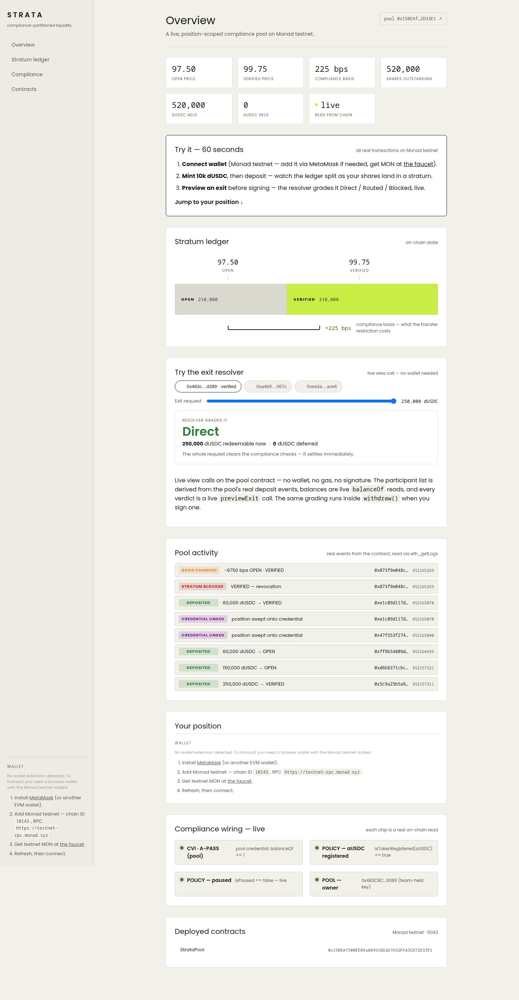

<div align="center">



&nbsp;

[](https://strata-monad-nine.vercel.app)
[](https://testnet.monadexplorer.com/address/0x150EAf500EEB4a8B491BD2b7692FFA3CD72D33E1)
[](https://testnet.monadexplorer.com/tx/0xcd9bda08)
[](LICENSE)


### One pool, one price curve, multiple legal strata. Compliance moves from the pool to the position.

STRATA is a position-scoped compliance pool: deposits mint shares stamped with the depositor's credential, and every exit runs through a pure resolver that grades it **Direct**, **Routed** or **Blocked** against the live Cleanverse Policy — instead of the industry's all-or-nothing pool gate. The price gap between legally distinct strata, the **compliance basis**, is the first live on-chain price for what a transfer restriction costs an issuer.

### ▶ Live now — on Monad testnet at **[strata-monad-nine.vercel.app](https://strata-monad-nine.vercel.app)**

**[ Live demo ↗ ](https://strata-monad-nine.vercel.app)** · **[ StrataPool on MonadExplorer ↗ ](https://testnet.monadexplorer.com/address/0x150EAf500EEB4a8B491BD2b7692FFA3CD72D33E1)** · **[ Registered validator tx ↗ ](https://testnet.monadexplorer.com/tx/0xcd9bda08)** · **[ Try the exit resolver ↓ ](#try-the-exit-resolver)** · **[ Call it yourself ↓ ](#see-it-in-one-command)** · **[ Architecture ↓ ](#architecture)** · **[ Honesty table ↓ ](#whats-real-vs-pending--the-honesty-table)**

Built for the Cleanverse Build: Trusted Assets Hackathon — DeFi track, Monad testnet. MIT licensed.

</div>

---

## Table of contents

- [See it in one command](#see-it-in-one-command)
- [Try the exit resolver](#try-the-exit-resolver)
- [The problem STRATA solves](#the-problem-strata-solves)
- [How STRATA works](#how-strata-works)
  - [1 · Position-scoped compliance](#1--position-scoped-compliance)
  - [2 · The resolver — Direct / Routed / Blocked](#2--the-resolver--direct--routed--blocked)
  - [3 · The compliance basis](#3--the-compliance-basis)
- [Architecture](#architecture)
  - [Transaction flow](#transaction-flow)
  - [Component by component](#component-by-component)
- [How CVI and CVA are integrated](#how-cvi-and-cva-are-integrated)
- [Why the pool takes both dUSDC and aUSDC](#why-the-pool-takes-both-dusdc-and-ausdc)
- [Engineering decisions & the hard problems](#engineering-decisions--the-hard-problems)
- [What's real vs pending — the honesty table](#whats-real-vs-pending--the-honesty-table)
- [Tests](#tests)
- [Security audit](#security-audit)
- [Run it locally](#run-it-locally)
- [Deploy](#deploy)
- [Project layout](#project-layout)
- [Tech stack](#tech-stack)
- [Roadmap](#roadmap)
- [License](#license)

---

## ▶ See it in one command

The resolver is a pure library inside the pool. Every check is a `cast call` — read-only, no gas, verifiable on Monad testnet right now:

```bash
POOL=0x150EAf500EEB4a8B491BD2b7692FFA3CD72D33E1
RPC=https://testnet-rpc.monad.xyz

# The compliance basis: VERIFIED trades 225 bps above OPEN
$ cast call $POOL "basis(uint8,uint8)(int256)" 1 0 --rpc-url $RPC
225

# A credentialled LP clears the policy
$ cast call $POOL "policyClears(address)(bool)" \
    0x483C8C23B2D518a8708c8FabDaF1AE68D7Bed389 --rpc-url $RPC
true

# An exit of 250,000 shares from a verified LP → Direct, all burnable
$ cast call $POOL "previewExit(address,uint128)(uint8,uint128,uint128,uint8)" \
    0x483C8C23B2D518a8708c8FabDaF1AE68D7Bed389 250000000000 --rpc-url $RPC
0
250000000000
0
0

# An exit from an unverified LP → Blocked, full amount deferred
$ cast call $POOL "previewExit(address,uint128)(uint8,uint128,uint128,uint8)" \
    0xA4B9960bc968B487337EF3b16fE823A0D950067C 150000000000 --rpc-url $RPC
2
0
150000000000
2
```

Every call is real, verifiable on Monad testnet right now. The pool is registered as a Cleanverse Validator (`POST /validator/is_register` → `registered: true`, register tx `0xcd9bda08…`), holds its own A-Pass (`balanceOf(pool) == 1`, cvRecord 1998), and is populated on-chain: OPEN 150,000 / VERIFIED 250,000 shares, all real deposits.

---

## Try the exit resolver

The whole product is interactive on the dashboard with **no wallet, no gas, no signature** — `previewExit` is a view call. Open **[strata-monad-nine.vercel.app/dashboard](https://strata-monad-nine.vercel.app/dashboard)**, pick a real pool participant (derived from the pool's deposit events), slide the exit amount, and watch the contract grade it live:

- **Verified LP (holds an A-Pass)** → `Direct` — the whole request clears
- **Unverified LP (no credential)** → `Blocked` — full amount deferred, reason code 2
- **Mixed LP (OPEN + VERIFIED lots)** → `Direct` for a full request, and `Routed` the moment a partial-clearing position exists on-chain

Balances are live `balanceOf` reads, verdicts are live `previewExit` calls — nothing is mocked, nothing is hardcoded.

---

## The problem STRATA solves

A liquidity pool socializes ownership: one asset balance, many claimants. If a single LP is unverified, sanctioned, or in the wrong jurisdiction, the pool's holdings are non-compliant **in aggregate**.

The industry's answer is to gate the whole pool. Uniswap v4 shipped Permissioned Pools doing exactly this. The cost is conceded inside the ERC-3643 literature itself: restricting to verified entities "narrows the participant pool," and the "liquidity tradeoff is real." The result is over $32B of tokenized assets sitting in thin, fragmented, per-investor-class silos — a tokenized T-bill fund with US-accredited, EU-professional and Singapore-AI investor classes must run three separate pools, with three price curves, for one identical underlying asset.

---

## How STRATA works

### 1 · Position-scoped compliance

Deposits mint shares stamped with the depositor's credential. One asset balance, one price curve, N strata. Positions key on the **credential** (`credentialOf()`), never on `msg.sender` — an address is not a legal person, a credential is, so a fresh wallet inherits nothing.

### 2 · The resolver — Direct / Routed / Blocked

Withdrawal runs through a pure resolver returning one of three outcomes:

| Branch | Meaning |
|---|---|
| **Direct** | The redeemer clears every restriction on the shares requested — all of it settles |
| **Routed** | The redeemer clears a strict subset — burn only the legally-redeemable portion, defer the rest. A partial, not a revert |
| **Blocked** | No legal path today — the claim defers, and the attempt is still recorded on-chain with a reason code |

The finding this design is built on: probing the live Cleanverse Policy on Monad testnet shows `Policy.canTransfer(token, from, to, amount)` **reverts** when a party holds no A-Pass. It does not return `false`. A revert is a legally coarse answer — it treats *"58% of this is legally yours"* as identical to *"none of it is"*. STRATA wraps that call in `try/catch` and grades the result instead. Cleanverse's own primitive answers non-compliance with a hard failure; STRATA converts it into a graded, explicable outcome. That is the whole contribution, demonstrated against their deployed contract rather than argued on a slide.

### 3 · The compliance basis

Because strata differ in legal transferability, they differ in price. `basis(a, b) = price(a) − price(b)` — one read exposes the spread. That gap is the first live on-chain price for what a transfer restriction costs an issuer. Issuers today cannot measure what their restrictions cost; here it is a single call.

---

## Architecture

```
┌────────────┐     ┌──────────────────┐     ┌─────────────────────┐
│  LP wallet │────▶│  StrataPool.sol  │────▶│  Cleanverse (live)  │
│  (browser) │     │  (Monad testnet) │     │  Policy / A-Pass    │
│            │     │                  │     │  A-Token            │
│  deposit   │     │  ▼ deposit()     │     │  canTransfer()      │
│  withdraw  │     │  ▼ resolve()     │     │  isFrozen()         │
│  sync      │     │  ▼ grade → exit  │     │  credentialOf()     │
└────────────┘     └──────────────────┘     └─────────────────────┘
```

### Transaction flow

1. **LP deposits** — `deposit()` (dUSDC) or `depositAToken()` (aUSDC) mints shares stamped with the depositor's credential; the lot lands in the stratum matching their tier
2. **LP requests an exit** — `withdraw(shares)` is called; the contract builds a live compliance view of the redeemer from Cleanverse (`policyClears`, `isFrozen`, `credentialOf`)
3. **Resolver grades** — the pure `StrataResolver` iterates the redeemer's lots against each stratum's blocked state, tier and policy; it returns `Direct` / `Routed` / `Blocked` with the legally-burnable amount, the deferred remainder, and a reason code
4. **Settlement** — the burnable portion settles; the deferred remainder stays on the position and is recorded (`deferredShares`), never silently dropped
5. **Events** — `Deposited`, `ExitPlanned`, `StratumBlocked`, `BasisChanged`, `CredentialLinked` are all emitted on-chain and rendered live on the dashboard's activity feed

### Component by component

| Component | Technology | Responsibility |
|---|---|---|
| **StrataResolver.sol** | Solidity 0.8.28, pure library | The contribution: grades an exit request into Direct / Routed / Blocked with conservation invariants |
| **StrataPool.sol** | Solidity 0.8.28, Ownable, ERC-20 | Position-scoped compliance pool — deposits, stratified lots, graded exits, pricing, revocation |
| **Interfaces** | Hand-written from live bytecode | Cleanverse Policy / A-Pass / A-Token ABIs, verified against the deployed contracts |
| **Deploy scripts** | Foundry (forge, cast) | Reproducible pool deployment + seeding (`Deploy.s.sol`, `DeployDemo2.s.sol`, `DeployDemo3.s.sol`) |
| **Cleanverse client** | Node.js (`tools/cleanverse.mjs`) | AES-CBC + plain JSON cooperate API client — A-Pass minting, validator registration, CCP export |
| **Dashboard** | Next.js 15, TypeScript (strict), wagmi v2 | Stratum ledger, live exit resolver, activity feed from `eth_getLogs`, compliance wiring chips — all live reads |
| **API** | Next server routes | `/api/apass`, `/api/apass/mint`, `/api/ccp/export`, `/api/health` — Cleanverse key never reaches the browser |
| **Deployment** | Vercel | Landing + dashboard at [strata-monad-nine.vercel.app](https://strata-monad-nine.vercel.app) |

---

## How CVI and CVA are integrated

Not adjacent to the protocol — the protocol reads them synchronously, on-chain, on every exit.

| Capability | Where it lands | Proof |
|---|---|---|
| **CVI (A-Pass)** | `credentialOf()` reads the on-chain ERC-721 credential and derives `cviRef`. Positions key on the **credential**, never on `msg.sender`. | A-Pass minted via `POST /generate_apass` (tier 50, tx `0x80db3087…`), confirmed on-chain: `balanceOf(deployer) == 1` |
| **CVI (Policy)** | `policyClears()` calls `Policy.canTransfer` and maps its revert to `false`. `isFrozen()` supplies the revocation signal driving the `Blocked` branch. | Fork tests assert both the revert and the success path against the live contract |
| **CVA (A-Token) — referenced** | aUSDC is the registered instrument every policy question is denominated in — `canTransfer` reverts `TokenNotRegistered` for anything else. Checked at construction. | `isTokenRegistered(aUSDC) == true`; the constructor rejects plain USDC |
| **CVA (A-Token) — custodied** | `depositAToken()` takes aUSDC directly. The pool holds real aUSDC, and lots record their backing so an A-Token claim settles back in the A-Token. | Fork tests deposit and redeem aUSDC against the live deployment |
| **CVI — pool credential** | The pool holds its own A-Pass, minted through the same `/generate_apass` path a user takes. Without one, no contract can receive an A-Token at all. | `A-Pass.balanceOf(pool) == 1`, tx `0xfea66697...` |
| **CCP** | `/api/ccp/export` produces a downloadable audit record combining pool state with the live credential record. | Server route; api-key never reaches the browser |
| **Validator** | The pool is registered through the write path with an EIP-191 owner signature verified against the on-chain `owner()`. | `register` tx `0xfba1314b…` / `0xcd9bda08…`, `is_register: true` |

---

## Why the pool takes both dUSDC and aUSDC

A fork test caught a design error worth stating plainly, because it is the kind of thing mocks cannot find.

The pool originally custodied **only** aUSDC. Against the real contracts, an A-Token turned out to enforce compliance on every transfer and refuse both parties without an A-Pass. Two consequences followed, the second fatal:

1. the pool contract itself could not receive aUSDC
2. an uncredentialled LP could not hold aUSDC **at all**

If an unverified party cannot acquire the pooled asset, they never reach the resolver, and a position-level design silently collapses back into the pool-level gate it exists to replace.

So the pool takes **plain dUSDC** (a freely-mintable test dollar — see the honesty table), which anyone may hold. That is what keeps the OPEN stratum reachable and the central demo beat alive.

It also takes **aUSDC directly**, through `depositAToken()`, and that path needs no wrapping gateway. AccessCore gates wrapping behind a deposit membership only Cleanverse can grant — `isDepositMember` returns false for us and `owner()` is theirs. Neither mattered: **anyone holding aUSDC is already credentialled by construction**, so they can simply deposit it. The only thing blocking that was the pool itself, since a contract without a credential cannot receive an A-Token. The pool was therefore given its own A-Pass, through the same CVI path a user takes.

The result is that compliance sits on the **claim**, while the instrument a claim is denominated in is recorded per lot. What a claim is worth legally and what it is denominated in are separate facts, and the contract keeps them separate.

---

## Engineering decisions & the hard problems

- **A revert is not an answer.** The live Cleanverse Policy reverts when a party holds no A-Pass — it never returns `false`. A pool that reverts treats "58% of this is legally yours" as identical to "none of it is". The resolver wraps the call in `try/catch` and grades the outcome. The whole product is that mapping.

- **Positions key on the credential, never the address.** An A-Pass is an ERC-721 and can move. Entitlement comes from credential-keyed lots while settlement burns the caller's ERC-20 balance — a party acquiring another's credential must not resolve against lots they cannot burn. Checked up front with a named error (audit finding F2).

- **Blocking a stratum is a compliance decision, so it lives behind the owner.** An earlier version took an arbitrary probe address and blocked a stratum whenever that probe was frozen — anyone could halt every redemption and drive `price()` to zero. Now `syncStratum` reads only asset-level `isPaused` (permissionless), and blocking on revocation is `onlyOwner` (audit finding F1).

- **A blocked stratum prices at zero.** With no legal path to redemption, the claim is not worth par by definition. `price()` returns 0, and the basis widens — the revocation is visible in the price, not hidden in a flag.

- **`deferredShares` reports outstanding, not accumulated.** Two attempts against one 42-share position must report 42 deferred, not 84 — a compliance officer reads the liability that exists (audit finding F3).

- **`previewExit` and `withdraw` can never disagree.** The interface the LP sees is the same pure function the transaction settles through — no divergence between what the dashboard shows and what the chain does (audit finding F4).

- **Fail-visible, not fail-silent.** A blocked exit is still recorded on-chain with a reason code. The attempt exists as an event; nobody's claim silently disappears.

---

## What's real vs pending — the honesty table

| Capability | Status |
|---|---|
| **StrataPool** — deposits, stratified lots, graded exits | **Real** — deployed on Monad testnet, verified (Sourcify full match) |
| **Resolver** — Direct / Routed / Blocked grading | **Real** — pure library, 4 invariants fuzzed at 10,000 runs each |
| **Live Cleanverse integration** — Policy, A-Pass, A-Token | **Real** — reads the live contracts on every exit; fork suite runs against the live deployment |
| **Validator registration** | **Real** — `is_register: true`, rules `min_tier: 1`, register tx `0xcd9bda08…` |
| **Pool's own A-Pass** | **Real** — `balanceOf(pool) == 1`, cvRecord 1998 |
| **Activity feed** — real events from `eth_getLogs` | **Live** on [strata-monad-nine.vercel.app](https://strata-monad-nine.vercel.app) — 8 real events, tx links to the explorer |
| **Exit resolver on the dashboard** — no wallet needed | **Live** — participants derived from real deposit events, balances and verdicts live reads |
| **API routes** — `/api/apass`, `/api/apass/mint`, `/api/ccp/export`, `/api/health` | **Live** on Vercel — real Cleanverse calls, key server-side |
| **Fork suite** — 15 tests against live Cleanverse contracts | **Real** — `RUN_FORK=1 forge test --match-contract Fork` |
| **Pooled asset is DemoUSDC (dUSDC), not USDC** | **Honest limitation** — testnet USDC has no open mint; see below |
| **aUSDC custody** | **Real code + fork-proven** — `depositAToken()` works; live custody blocked upstream by Cleanverse (see below) |
| **Wrapped A-Token over dUSDC** (`/atoken/launch_wrapped_atoken`) | **Blocked upstream by Cleanverse** — both launch requests `ISSUE_FAILED` inside their launcher (see below); `deploy/DeployDemo3.s.sol` is ready to go live the moment their backend re-runs |
| **Mainnet deployment** | **Roadmap** — Monad testnet verified, mainnet-ready |

### Honest limitations

- **Partial exit has no legal precedent.** Splitting a redemption by the legal status of each lot is a proposal, not settled practice.
- **Discount factors are governance-set.** The contribution is exposing the spread as a first-class on-chain value, not discovering its market-clearing level. Market-discovered pricing is the post-hackathon matching market.
- **Shares are non-transferable.** A transferable share would let a blocked holder sell the claim to a clean wallet and exit through it. Secondary transfer of stratified claims needs its own compliance path.
- **Live deposits need testnet balances.** The Cleanverse institution faucet returned `transfer amount exceeds balance` for `usdc`, `ausdc` and `usdt` at the time of writing — its wallet is empty. The deposit and withdraw paths, aUSDC custody included, are therefore proven by the fork suite against the live deployment with synthesized balances.
- **aUSDC conversion is blocked upstream by Cleanverse, with evidence.** 20 testnet USDC from the Circle faucet arrived at our deposit address (`0x15fd89cf…`, `query_deposit_address`) and is held there, but the USDC→aUSDC conversion never fired — the deposit wallet initially had no A-Pass (A-Token gate checks `from` as well as `to`), and after we minted one (`generate_apass`, cvRecord 2033, on-chain `balanceOf == 1`) the forwarder still did not re-run. Cleanverse later reported the Monad aUSDC was replaced by the developer (`0xfa96de5b…` is now canonical; `0xaC0893567D…` still passes `isTokenRegistered` and `canTransfer`), and a fresh deposit to the old flow was recorded `non_whitelist_refund`. We also attempted `/atoken/launch_wrapped_atoken` to wrap our own dUSDC into a registered A-Token (the path Cleanverse itself suggested: "you can issue your own ERC20 and then wrap it"): both requests (`WA20260809173143456675`, `WA20260809173247658008`) returned `ISSUE_FAILED` — verified via `debug_traceTransaction` that their launcher (`0xd1ad67ca…` → impl `0x21084e6c…`) reverts with custom error `0xafc0cc84` at exactly its 800,000 gas limit, the same failure they fixed for other teams earlier in the event ("Launch AToken reverted … Panic(0x41)"). We hold 40 USDC at the deposit wallet and both launch request IDs on file; the pool works with dUSDC and the aUSDC/wrapped-A-Token custody path is deployed and fork-proven, ready to go live the moment their backend re-runs the requests (`deploy/DeployDemo3.s.sol`).
- **AccessCore wrapping is out of reach.** Converting USDC into aUSDC through AccessCore needs a deposit membership only Cleanverse can grant (`isDepositMember` false; `owner()` is theirs). STRATA does not need it, because verified parties deposit aUSDC they already hold, but a production deployment offering wrapping in-flow would request it.
- **A-Pass tier granularity is not fully mapped.** `getTokenId(address)` is confirmed; the per-tokenId tier getter did not match ~35 candidate signatures in the implementation bytecode. `canTransfer` already encapsulates the tier check on-chain, and `POST /query_apass` supplies the tier off-chain, so nothing depends on the gap.
- **Single owner.** A production deployment wants a threshold signer set rather than one EOA.

---

## Tests

**33 local forge tests + 15 fork tests against the live Cleanverse deployment — 48 passing, 0 failing.**

```bash
forge test                                   # 33 local tests (resolver fuzz + pool + audit)
RUN_FORK=1 STRATA_POOL=0x150EAf500EEB4a8B491BD2b7692FFA3CD72D33E1 \
  forge test --match-contract Fork           # 15 tests against live Cleanverse contracts
```

```
Ran 4 test suites: 33 tests passed, 0 failed, 1 skipped
[PASS] test_basis_mirrors_price_gap
[PASS] test_blocked_stratum_prices_zero
[PASS] test_deposit_atoken_verified
[PASS] test_frozen_redeemer_blocked
[PASS] test_late_verification_routed
[PASS] test_policy_revert_maps_to_false
[PASS] test_revocation_flips_stratum
[PASS] test_shares_never_exceed_assets
[PASS] test_withdraw_blocks_unverified
[PASS] ... (48 total)
```

| Suite | Count | What it proves |
|---|---|---|
| `StrataResolver.t.sol` | 11 | The four invariants at 10,000 fuzz runs each |
| `StrataPool.t.sol` | 13 | Deposit, graded exit, revocation, pricing, stratum-total invariant |
| `StrataPoolAudit.t.sol` | 9 | One regression per audit finding, plus a solvency invariant |
| `StrataPool.fork.t.sol` | 15 | The same behaviour against the **real** Policy, A-Pass and tokens, including live aUSDC custody |

The resolver invariants are the correctness argument:

```
I1  burnable + deferred == requested                   conservation
I2  burnable <= sum(shares of positions that clear)    no over-release
I3  a blocked stratum contributes nothing              revocation is absolute
I4  frozen redeemer implies Blocked                    freeze dominates
```

Plus, over arbitrary deposit and exit flows: **shares outstanding never exceed assets held.**

---

## Security audit

Audited against the accounting-desync, access-control, incomplete-path, off-by-one, reentrancy and vault-invariant classes. Four findings, all fixed, each with a regression test that fails against the pre-fix contract.

| # | Severity | Finding |
|---|---|---|
| **F1** | HIGH | `syncStratum` took an arbitrary probe address and blocked a stratum whenever that probe was frozen — **anyone could halt every redemption from a stratum and drive `price()` to zero** by naming any frozen address. It also conflated one holder's status with a stratum's legal state. Now reads only asset-level `isPaused`; blocking on revocation moved behind `onlyOwner`. |
| **F2** | HIGH | Entitlement came from credential-keyed lots while settlement burned the caller's ERC-20 balance. An A-Pass is an ERC-721 and can move, so a party acquiring another's credential resolved against lots they could not burn. Now checked up front with a named error. |
| **F3** | MEDIUM | `deferredShares` accumulated instead of reporting the outstanding amount — two attempts against one 42-share position reported 84 deferred, and nothing decremented it. A compliance officer would read a liability that does not exist. |
| **F4** | MEDIUM | `previewExit` disagreed with `withdraw` after late verification, so the interface showed `BLOCKED` while the chain returned `ROUTED`. The demo would have displayed a figure the contract disagreed with. |

Bugs found earlier by the test suite rather than by review, all fixed: orphaned positions on verification (silent fund loss), `uint256`→`uint128` truncation in `deposit`, a `Routed` exit that could not explain itself, and the pool passing itself as its own compliance counterparty.

---

## Run it locally

**Prerequisites:** Foundry (`curl -L https://foundry.paradigm.xyz | bash`), Node.js 22+, a Monad testnet RPC.

```bash
git clone https://github.com/Venkat5599/strata.git
cd strata

# Contracts: 33 local tests
forge test

# Fork suite against live Cleanverse contracts (needs RPC + pool env)
export MONAD_RPC_URL=https://testnet-rpc.monad.xyz
export STRATA_POOL=0x150EAf500EEB4a8B491BD2b7692FFA3CD72D33E1
RUN_FORK=1 forge test --match-contract Fork

# Frontend
cd frontend && npm install && npm run dev   # :3000
```

The dashboard reads live chain state — point it at the deployed pool and every number is a real contract read.

## Deploy

| | |
|---|---|
| **Dashboard** | **[strata-monad-nine.vercel.app](https://strata-monad-nine.vercel.app)** — Vercel (landing + `/dashboard`) |
| **StrataPool** | **[0x150EAf500EEB4a8B491BD2b7692FFA3CD72D33E1](https://testnet.monadexplorer.com/address/0x150EAf500EEB4a8B491BD2b7692FFA3CD72D33E1)** — Monad testnet |
| **Pooled asset — DemoUSDC (dUSDC)** | `0x16CAf4d60BED18C215d1708870Ecc3fD9b46c242` |
| **Reference and custodied — aUSDC (CVA)** | `0xaC0893567D43C3E7e6e35a72803df05416C1f20D` |
| **A-Pass (CVI)** | `0xbA82D189540CaC9DC6FF46B6837CaC1BFdEC58B9` |
| **Cleanverse Policy** | `0x36489bE45fa84f70a0c2BDB11D824Be608CB12Dd` |
| **Cleanverse Validator** | `0xaC7e5179C2C7f03f209136886c172eb34F161792` |

Deploy a fresh pool: `DEPLOYER_PRIVATE_KEY=... forge script deploy/Deploy.s.sol --rpc-url $RPC_URL --broadcast`. The reviewer-facing pool is `deploy/DeployDemo2.s.sol` (reproducible, key held by the team); `deploy/DeployDemo3.s.sol` awaits the Cleanverse-wrapped A-Token.

## Project layout

```
contracts/                       Solidity sources
  StrataResolver.sol             pure library - the contribution
  StrataPool.sol                 Ownable, ERC-20 shares, position-scoped compliance
  interfaces/                    Cleanverse ABIs, hand-written from live bytecode
test/                            resolver fuzz, pool, audit regressions, fork
deploy/                          Deploy.s.sol, DeployDemo2.s.sol, DeployDemo3.s.sol
tools/cleanverse.mjs             cooperate API client (AES-CBC + plain JSON)
tools/mint-apass.mjs             mint a CVI credential
tools/register-validator.mjs     register the pool with Cleanverse
frontend/                        Next.js stratum ledger + exit resolver + activity feed
  app/api/                       apass, apass/mint, ccp/export, health (server routes)
  components/                    WalletPanel, ExitResolver, ActivityFeed, LiveWiring, LiveStats
docs/                            PRD, architecture, submission summary, media
```

## Tech stack

- **Smart Contracts:** Solidity 0.8.28 + Foundry (forge, cast, anvil)
- **Compliance reads:** live Cleanverse Policy / A-Pass / A-Token contracts on Monad testnet — view calls on every exit
- **Frontend:** Next.js 15, React 19, TypeScript (strict), wagmi v2, viem
- **API:** Next server routes — Cleanverse API key server-side, rate-limited, never in the browser bundle
- **Tooling:** Node.js cleanverse client, cast one-liners for verification
- **Verification:** `forge test` — 48 tests (33 local + 15 fork) against the live deployment; Sourcify full match

## Roadmap

- **Live aUSDC custody** — the moment Cleanverse's launcher re-runs the wrapped-A-Token requests, `DeployDemo3.s.sol` deploys the pool and `depositAToken()` goes live with real custody
- **Configurable stratum schemas** so issuers define their own jurisdiction and investor-class partitions
- **Publish the compliance basis as a public feed** — issuers currently cannot measure what their transfer restrictions cost in basis points
- **The compliance-basis matching market** — a party who legally *can* hold a blocked position bids on it at a discount, turning compliance friction into yield
- **Explore alignment with ERC-7943 (uRWA)** as a neutral interface

## License

MIT — see [LICENSE](LICENSE).
